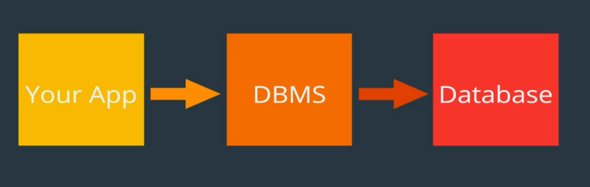

# MySQL-Notes

This repository contains notes on MySQL which I have prepared while learning it. This repository will be updated whenever I find something new and useful related to MySQL. Learners can take full advantage of this repository. 

Let's start learning.......

<h2> What is a Database? </h2>

A database can be defined as a collection of data. It is a collection of information that is organized so that it can be easily accessed, managed and updated. The data stored in a database can be of anything either sales data, transaction data or even simple records.

If I talk about a physical database, a phonebook is an example of it. :sweat_smile:

<h2> Database Management System </h2>

The simplest definition of Database Management System is that it is a software which is used to manage(acesss, update) the database. DBMS provides an interface to perform various operations like database creation, storing data in it, updating data, creating a table in the database and a lot more.
 
Examples are:- MySQL, Oracle database, PostgreSQL and many more.



<h2> Difference between MySQL and SQL </h2>

SQL which stands for structured query language is a language which is used by the database management system to interact with the databases. All relational database management system make use of SQL to interact with the database. All relational DBMS use SQL but that does not mean that all are identical. They is a slight difference in syntax in every DBMS and also the features of database management system are different from each other.


<b> Let's get our hands dirty on some commands. <b> 

For any help just type the following command in MySQL prompt.
```javascript
help;
```

To see all the databases created so far, type the following command.
```javascript
show databases;
```


 
